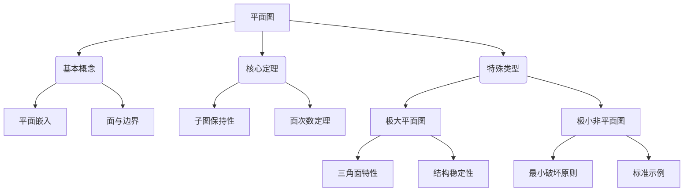
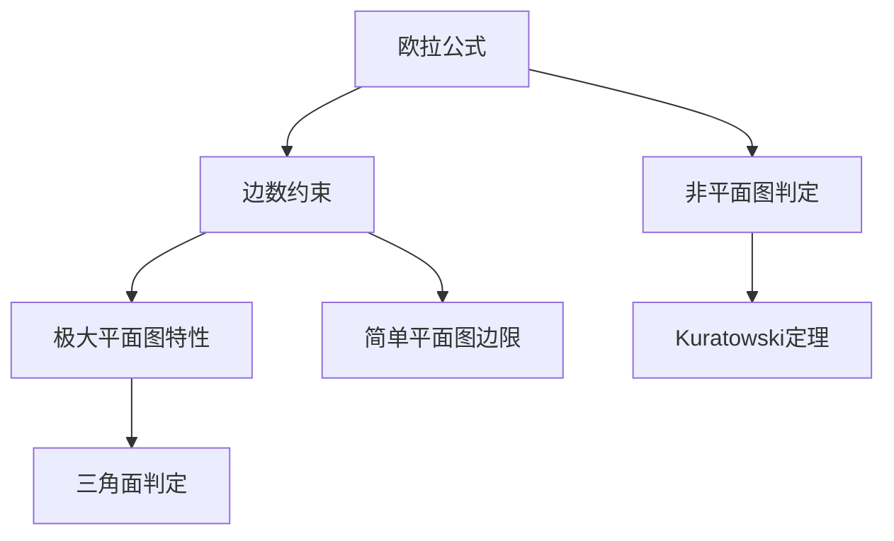
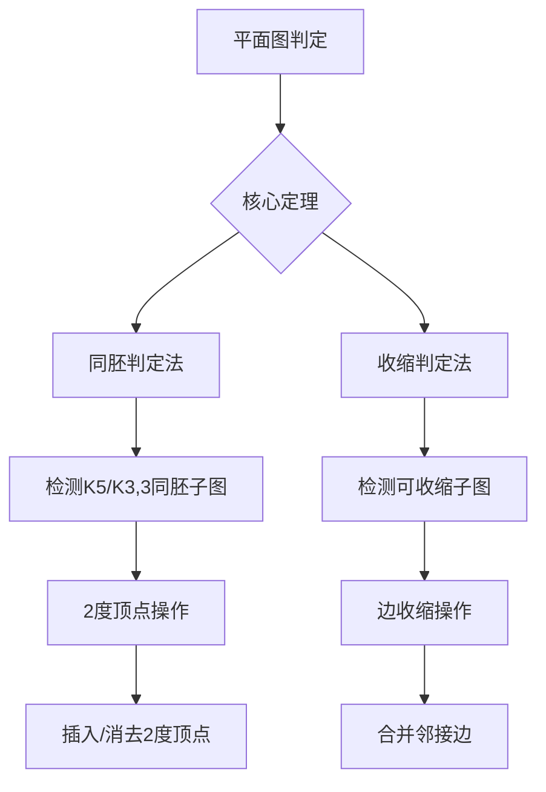

 # 01平面图的基本概念

## 一、基本概念

### 1.1 平面图定义
**定义8.1.1**  
无向图G若能在平面上绘制使得除顶点外无边相交，则称G为：
- **可平面图**（平面图）
- 对应的无交叉绘制称为**平面嵌入**
- 无平面嵌入的图称为**非平面图**

### 1.2 面与边界
**定义8.1.2**  
在平面嵌入中：
- **面**：由边划分的封闭区域
  - 无限面（外部面）$R_0$
  - 有限面（内部面）$R_1,R_2,...,R_k$
- **面次数**：包围面的边界的长度，记作$\deg(R)$

## 二、核心定理

### 2.1 平面性保持
**定理8.1.1**  
- 平面图的子图必为平面图
- 非平面图的母图必为非平面图

**推论**：
- $K_n (n \leq 4)$ 和 $K_{2,n} (n \geq 1)$ 的**所有子图**均为平面图
- 含$K_5$或$K_{3,3}$子图的图必为非平面图

### 2.2 结构稳定性
**定理8.1.2**  
平面图中添加平行边或环后仍保持平面性  
$\Rightarrow$ 研究平面性时可不考虑平行边和环

### 2.3 面次数定理
**定理8.1.3**  
平面图所有面的次数之和满足：
$$
\sum \deg(R) = 2|E|
$$
（边数两倍关系）

## 三、极大平面图

### 3.1 定义与示例
**定义8.1.3**  
简单平面图G满足：
- 是$K_i (1 \leq i \leq 4)$，或
- 任意添加新边都会破坏平面性

**典型示例**：
- $K_1, K_2, K_3, K_4$
- $K_5 - e$（删除任意一条边的完全图）

### 3.2 结构特性
**定理8.1.4**  
极大平面图必满足：
- 连通性
- 当$n \geq 3$时无割点与桥

**定理8.1.5**  
（n阶简单连通平面图判定）  
$G$是极大平面图 $\iff$ 每个面次数均为3

## 四、极小非平面图

### 4.1 定义与示例
**定义8.1.4**  
非平面图G若满足：
- 删除任意一条边后变为平面图

**典型示例**：
- $K_5$（五阶完全图）
- $K_{3,3}$（完全二分图）

---

## 知识图谱

# 02欧拉公式

## 一、基本定理

### 1. 欧拉公式（定理8.2.1）
**适用对象**：连通平面图  
**公式**：  
$$n - m + r = 2$$  
**参数定义**：
- $n$：顶点数
- $m$：边数
- $r$：面数（含外部面）

### 2. 推广欧拉公式（定理8.2.2）
**适用对象**：具有$k$个连通分支的平面图  
**公式**：  
$$n - m + r = k + 1$$

---

## 二、平面图边数约束

### 1. 面次数约束（定理8.2.3）
**条件**：
- 连通平面图
- 每个面次数至少为$l$（$l \geq 3$）

**边数限制**：  
$$m \leq \frac{l}{l-2}(n - 2)$$

### 2. 极大平面图边数公式（定理8.2.5）
**条件**：
- $n \geq 3$阶极大平面图

**公式**：  
$$m = 3n - 6$$

### 3. 简单平面图边数上限（推论8.2.2）
**公式**：  
$$m \leq 3n - 6$$

---

## 三、非平面图判定

### 1. 典型非平面图（推论8.2.1）
**结论**：
- $K_5$（完全五阶图）是非平面图  
  $$当m=10时，9 \geq 9 \Rightarrow 矛盾$$
- $K_{3,3}$（完全二分图）是非平面图  
  $$当m=9时，8 \geq 8 \Rightarrow 矛盾$$

**判定依据**：违反定理8.2.3的边数限制

---

## 四、特殊平面图性质

### 1. 极大平面图特性
- 每个面均为三角形（3-面）
- 满足边数公式$m = 3n - 6$
- 添加任意新边会破坏平面性

### 2. 平面图最小度定理（定理8.2.6）
**结论**：简单平面图的最小度满足  
$$\delta(G) \leq 5$$

**推论**：不存在6-正则简单平面图

---

## 六、定理关系图谱

# 03平面图判定核心知识点整理

## 一、核心定义

### 1. 2度顶点操作（定义8.3.1）
**插入操作**：  
对边 $e=(u,v)$ 执行：
1. 删除边 $e$
2. 新增顶点 $w$
3. 添加边 $(u,w)$ 和 $(w,v)$

**消去操作**：  
对2度顶点 $w$（邻接顶点为 $u,v$）执行：
1. 删除顶点 $w$
2. 添加边 $(u,v)$

### 2. 同胚关系
两个图 $G_1$ 与 $G_2$ 称为**同胚**，当且仅当：
- 通过有限次2度顶点插入/消去操作后同构
- 或原本就同构

---

## 二、库拉托夫斯基定理（平面图判定）

### 定理8.3.1（同胚判定法）
图 $G$ 是平面图 $\iff$  
$G$ 中不存在与以下两种图同胚的子图：
- 完全图 $K_5$
- 完全二分图 $K_{3,3}$

### 定理8.3.2（收缩判定法）
图 $G$ 是平面图 $\iff$  
$G$ 中不存在可收缩为以下两种图的子图：
- 完全图 $K_5$
- 完全二分图 $K_{3,3}$

---

## 三、关键要点

### 1. 不可平面图特征
- $K_5$：5个顶点的完全图（边数10）
- $K_{3,3}$：3+3顶点的完全二分图（边数9）

### 2. 定理应用方法
| 操作类型       | 判定依据           | 典型应用场景       |
|----------------|--------------------|--------------------|
| 同胚子图检测   | 寻找$K_5/K_{3,3}$变形 | 结构较简单的图分析 |
| 子图收缩检测   | 寻找可收缩的子图   | 复杂图平面性判定   |

### 3. 重要性质
- 同胚操作保持平面性不变
- 收缩操作是边合并操作（不同于子图删除）

---

## 知识图谱 

 