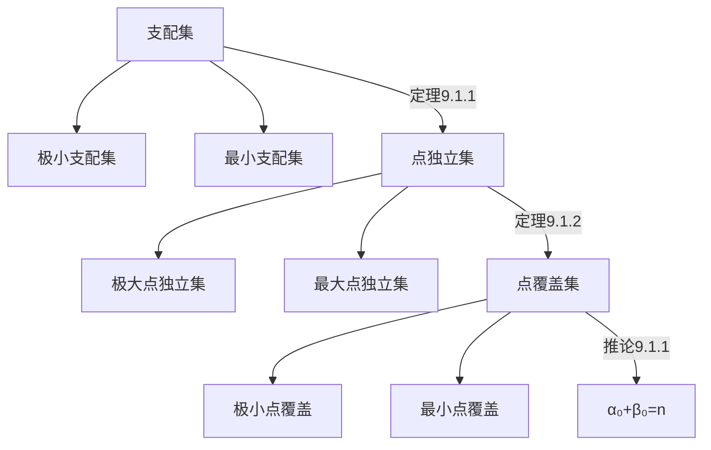

# 01.支配集、点独立集与点覆盖集

## 一、支配集理论

### 定义9.1.1（支配集）
设无向简单图$G=(V,E)$，$V^* \subseteq V$满足：
1. **支配条件**：$\forall v_i \in V \setminus V^*,\ \exists v_j \in V^*$使得$(v_i, v_j) \in E$
2. **极小性**：$V^*$的任何真子集都不满足支配条件 → 称为**极小支配集**
3. **最优性**：顶点数最少的支配集称为**最小支配集**
4. **支配数**：记作$\gamma_0(G)$，表示最小支配集的顶点数

## 二、点独立集理论

### 定义9.1.2（点独立集）
设无向简单图$G=(V,E)$，$V^* \subseteq V$满足：
1. **独立性**：$V^*$中任意两顶点不相邻
2. **极大性**：$V^*$添加任何新顶点后失去独立性 → 称为**极大点独立集**
3. **最优性**：顶点数最多的点独立集称为**最大点独立集**
4. **独立数**：记作$\beta_0(G)$，表示最大点独立集的顶点数

## 三、点覆盖集理论

### 定义9.1.3（点覆盖集）
设无向简单图$G=(V,E)$，$V^* \subseteq V$满足：
1. **覆盖性**：$\forall e \in E,\ \exists v \in V^*$与$e$关联
2. **极小性**：$V^*$的任何真子集都不满足覆盖性 → 称为**极小点覆盖**
3. **最优性**：顶点数最少的点覆盖称为**最小点覆盖**
4. **覆盖数**：记作$\alpha_0(G)$，表示最小点覆盖的顶点数

## 四、核心定理体系

### 定理9.1.1（独立集与支配集关系）
设无孤立点的无向简单图$G$，则：
$$
\text{极大点独立集} \subseteq \text{极小支配集}
$$

### 定理9.1.2（覆盖集与独立集对偶性）
设无孤立点的无向简单图$G$，则：
$$
V^*\text{是点覆盖} \iff V \setminus V^*\text{是点独立集}
$$

### 推论9.1.1（参数关系定理）
对于$n$阶无孤立点图$G$：
1. **极小-极大对应**：
 $$
   V^*\text{是极小点覆盖} \iff V \setminus V^*\text{是极大点独立集}
 $$
2. **数值关系**：
 $$
   \alpha_0(G) + \beta_0(G) = n
 $$

## 五、概念关系图谱

# 02边覆盖集与匹配

## 9.2 边覆盖集与匹配

### 一、边覆盖集相关定义
#### 定义9.2.1（边覆盖集）
设无向简单图$G = (V, E)$没有孤立点，$E^* \subseteq E$，若对$\forall v \in V$，$\exists e \in E^*$使得$v$与$e$相关联，则称：
1. **边覆盖集**：$E^*$为$G$的边覆盖集（简称边覆盖），称$e$覆盖$v$
2. **极小边覆盖**：若$E^*$的任何真子集都不是边覆盖，则称$E^*$为极小边覆盖
3. **最小边覆盖**：$G$的边数最少的边覆盖称为最小边覆盖
4. **边覆盖数**：最小边覆盖中的边数记作$\alpha_1(G)$，简记为$\alpha_1$

### 二、匹配相关定义
#### 定义9.2.2（边独立集/匹配）
设无向简单图$G = (V, E)$，$E^* \subseteq E$，若$E^*$中任何两条边均不相邻，则称：
1. **边独立集（匹配）**：$E^*$为$G$的边独立集（也称匹配）
2. **极大匹配**：若在$E^*$中再加任意一条边后所得集合都不是匹配，则称$E^*$为极大匹配
3. **最大匹配**：$G$的边数最多的匹配称为最大匹配
4. **匹配数**：最大匹配中的边数记作$\beta_1(G)$，简记为$\beta_1$
  
#### 定义9.2.3（匹配相关术语）
设$M$为图$G = (V, E)$的一个匹配：
1. **匹配边与非匹配边**：$M$中的边为匹配边，不在$M$中的边为非匹配边
2. **饱和点与非饱和点**：
   - 与匹配边相关联的顶点为饱和点
   - 不与匹配边相关联的顶点为非饱和点
1. **完美匹配**：若$G$中每个顶点都是饱和点，则称$M$为完美匹配
2. **交错路径与交错圈**：
   - **交错路径**：由匹配边和非匹配边交替构成的路径
   - **可增广路径**：起点和终点不同且均为非饱和点的交错路径
   - **交错圈**：由匹配边和非匹配边交替构成的圈

### 三、重要定理与推论

#### 定理9.2.1（边覆盖与匹配关系）
设$n$阶图$G$无孤立点：
1. **最大匹配构造最小边覆盖**：  
   若$M$是$G$的最大匹配，对每个$M$-非饱和点取一条关联边组成边集$N$，则$W = M \cup N$为$G$的最小边覆盖
2. **最小边覆盖构造最大匹配**：  
   若$W_1$是$G$的最小边覆盖，移去$W_1$中所有相邻边中的一条（移去边集为$N_1$），则$M_1 = W_1 - N_1$为$G$的最大匹配
3. **边覆盖数与匹配数关系**：  
 $$
   \alpha_1 + \beta_1 = n
 $$

#### 推论9.2.1（匹配与边覆盖大小关系）
设图$G$无孤立点，$M$是$G$的匹配，$W$是$G$的边覆盖，则：
$$
|M| \leq |W|
$$
当且仅当$|M| = |W|$时：
-$M$是$G$的完美匹配
-$W$是$G$的最小边覆盖

#### 定理9.2.2（最大匹配充要条件）
设$M$是图$G$的一个匹配，则：
$$
M \text{ 为 } G \text{ 的最大匹配} \iff G \text{ 中不含关于 } M \text{ 的可增广路径}
$$

### 关键公式总结
| 概念         | 公式                       |
| ---------- | ------------------------ |
| 边覆盖数与匹配数关系 |$\alpha_1 + \beta_1 = n$|
| 匹配与边覆盖大小关系 |$\|M\|\leq \|W\|$       |

---
# 03二部图中的匹配

## 一、完备匹配的定义

### 定义9.3.1（完备匹配）
设二部图$G = (V_1, V_2, E)$，满足$|V_1| \leq |V_2|$，若匹配$M$满足：
$$
|M| = |V_1|
$$
则称$M$为从$V_1$到$V_2$的**完备匹配**。

**性质**：
1. 完备匹配是二部图的**最大匹配**，但最大匹配不一定是完备匹配
2. 当$|V_1| = |V_2|$时，完备匹配即**完美匹配**

## 二、霍尔定理（存在完备匹配的充要条件）

### 定理9.3.1（霍尔定理/Hall定理）
设二部图$G = (V_1, V_2, E)$，其中$|V_1| \leq |V_2|$，则以下条件等价：
$$
G \text{ 中存在从 } V_1 \text{ 到 } V_2 \text{ 的完备匹配} \iff \forall k \in [1, |V_1|],\ V_1 \text{ 中任意 } k \text{ 个顶点至少与 } V_2 \text{ 中 } k \text{ 个顶点相邻}
$$

**解读**：
- 对$V_1$的所有子集$S \subseteq V_1$，需满足邻集$N(S) \subseteq V_2$的大小：
 $$
  |N(S)| \geq |S|
 $$
- 该条件称为**霍尔条件**，保证匹配的全局可扩展性

## 三、t条件定理（存在完备匹配的充分条件）

### 定理9.3.2（t条件定理）
设二部图$G = (V_1, V_2, E)$，若存在正整数$t$使得：
1.$V_1$中每个顶点**至少关联**$t$条边  
  $$
   \forall v \in V_1,\ \deg(v) \geq t
  $$
2.$V_2$中每个顶点**至多关联**$t$条边  
  $$
   \forall u \in V_2,\ \deg(u) \leq t
  $$
则$G$中**存在从$V_1$到$V_2$的完备匹配**。

**说明**：
- 此条件称为**t条件**，是完备匹配的充分但非必要条件
- 定理通过边数的双重约束保证邻集大小的平衡

## 四、t条件的补充说明

### 定理9.3.2的扩展分析
1. **非必要性**：存在满足完备匹配但不满足t条件的二部图  
   - 例如图9.3.1(a)（未展示）不满足t条件，但存在完备匹配
2. **应用场景**：  
   t条件为构造性证明提供工具，常用于：
   - 正则二部图的完备匹配存在性证明
   - 网络流模型中的容量平衡分析

## 关键结论总结
| 定理               | 条件类型       | 核心条件描述                     |
|--------------------|----------------|----------------------------------|
| 霍尔定理 (9.3.1)   | 充要条件       | 邻集大小不小于子集大小           |
| t条件定理 (9.3.2)  | 充分非必要条件 | 顶点度数满足$\deg_{V_1} \geq t$且$\deg_{V_2} \leq t$|

---
# 04着色

## 一、点着色基础

### 定义9.4.1（点着色与色数）
设无环无向图 $G=(V,E)$：
1. **点着色**：对每个顶点着色，使相邻顶点颜色不同
2. **k-可着色**：能用 $k$ 种颜色完成点着色
3. **色数 $\chi(G)$**：  
   满足 $G$ 是 $k$-可着色但不是 $(k-1)$-可着色的最小 $k$，简记 $\chi$

## 二、典型图色数性质

### 例9.4.1（特殊图类色数）
1. **零图**：$\chi(G)=1$ 当且仅当 $G$ 是零图
2. **完全图**：$\chi(K_n)=n$
3. **圈图**：
   - 偶圈：$\chi=2$
   - 奇圈：$\chi=3$
4. **轮图**：
   - 奇阶轮图：$\chi=3$
   - 偶阶轮图：$\chi=4$
5. **二部图**：$\chi(G)=2$（当 $G$ 含至少一条边时）

## 三、点着色核心定理

### 定理9.4.1（色数上界）
对任意无环图 $G$：
$$
\chi(G) \leq \Delta(G)+1
$$
其中 $\Delta(G)$ 为图的最大度数

### 定理9.4.2（布鲁克斯定理）
设连通图 $G$ 满足：
1. $n \geq 3$
2. $G$ 不是完全图 $K_n$
3. $G$ 不是奇圈

则有：
$$
\chi(G) \leq \Delta(G)
$$

## 四、平面图与面着色

### 定义9.4.2（面色数）
设平面图 $G$：
1. **k-可面着色**：能用 $k$ 种颜色对面着色，相邻面颜色不同
2. **面色数 $\chi^*(G)$**：满足面色数定义的最小 $k$

### 定理9.4.3（对偶图等价性）
平面图 $G$ 是 $k$-可面着色的 $\iff$ 其对偶图 $G'$ 是 $k$-可着色的

### 定理9.4.4（四色定理）
任何平面图都是 $4$-可面着色的：
$$
\chi^*(G) \leq 4
$$

## 五、边着色理论

### 定义9.4.3（边着色）
设图 $G=(V,E)$：
1. **k-可边着色**：能用 $k$ 种颜色对边着色，相邻边颜色不同
2. **边色数 $\chi'(G)$**：满足边着色要求的最小 $k$

### 定理9.4.5（维津定理）
对任意简单图 $G$：
$$
\Delta(G) \leq \chi'(G) \leq \Delta(G)+1
$$

### 定理9.4.6（二部图边色数）
对二部图 $G$：
$$
\chi'(G) = \Delta(G)
$$
