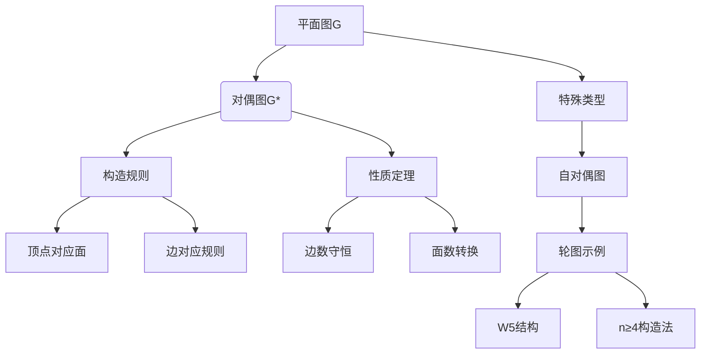

# 常见的离散型分布
## 2. Bernoulli Distribution (两点分布)

**定义 2.4** 若随机变量 $X$ 的分布列为：

| $X$ | 0     | 1   |
| :-- | :---- | :-- |
| $P$ | $1-p$ | $p$ |

其中 $0 < p < 1$，则称 $X$ 服从 0-1 分布，这是一个两点分布。

**解释** 任何试验，当只考虑某个事件 $A$ 是否出现时，可看成只有两种结果 $\{\bar{A}, A\}$ 的试验。只有两种可能结果的试验称为**伯努利试验 (Bernoulli Trial)**。例如，定义 2.1 那样的示性函数 $I_A$，它服从两点分布，恰好描述了伯努利试验。

## 3. Binomial Distribution (二项分布)

**定义 2.5** 若随机变量 $X$ 的分布列为：

$$P(X=k) = C_n^k p^k q^{n-k}, \quad k=0, 1, 2, \dots, n$$

其中 $0 < p < 1, q = 1-p$，则称 $X$ 服从参数为 $(n, p)$ 的二项分布。记为 $X \sim B(n, p)$。

**二项式定理**

$$(p+q)^n = \sum_{k=0}^{n} C_n^k p^k q^{n-k} = 1$$

因此，该分布列满足分布列应具备的两条性质，定义是合理的，这也是称它为二项分布的原因。显然，$B(1, p)$ 即为两点分布。

**独立重复试验 (Independent and Repeated Trials)** 在相同条件下，将同一试验重复进行，且各次试验的结果是相互独立的，这样的试验称为独立重复试验。将伯努利试验独立重复 $n$ 次，称为 $n$ 重伯努利试验。

### 定理2.2

设随机变量 $X \sim B(n, p)$，则
$$
P\left(X = \lfloor (n + 1)p \rfloor\right) = \max_{0 \leq k \leq n} \left\{ P(X = k) \right\}
$$
其中 $\lfloor (n + 1)p \rfloor$ 为 $(n + 1)p$ 的整数部分。

特别地，若 $(n + 1)p$ 本身为整数，则
$$
P\left(X = (n + 1)p\right) = P\left(X = (n + 1)p - 1\right) = \max_{0 \leq k \leq n} \left\{ P(X = k) \right\}$$

## 4. 泊松分布
#### 泊松定理
在$n$重伯努利试验中，设事件$A$出现的概率为$p_n$，如果
$$
\lim_{n \to \infty}np_n = \lambda (\lambda > 0)
$$
则
$$
\lim_{n \to \infty}C_n^k p_n^k (1-p_n)^{n-k} = \frac{\lambda^k e^{-\lambda}}{k!},k=0,1,2\dots
$$
应用：
$$
C_n^k p_n^k (1-p_n)^{n-k} \approx \frac{\lambda^k e^{-\lambda}}{k!},(\lambda =np)
$$

#### 定义2.6
若随机变量 $X$ 的分布列为：
$$
P(X = k) = \frac{\lambda^k e^{-\lambda}}{k!}, \quad k = 0,1,2,\ldots
$$
其中 $\lambda > 0$，则称 $X$ 服从参数为 $\lambda$ 的泊松分布，记为 $X \sim P(\lambda)$。

###### 合理性验证
$$
\sum_{k=0}^{\infty} P(X = k) = e^{-\lambda} \sum_{k=0}^{\infty} \frac{\lambda^k}{k!} = e^{-\lambda} \cdot e^{\lambda} = 1
$$

### 二项分布与泊松近似

设随机变量 $X \sim B(n, p)$，记 $\lambda = np$，当 $n$ 充分大且 $p$ 充分小时，有：
$$
\begin{aligned}
P(X = k) &= C_n^k p^k (1-p)^{n-k} \\
&\approx \frac{\lambda^k}{k!} e^{-\lambda} \cdot \left[ \prod_{i=0}^{k-1} \left(1 - \frac{i}{n}\right) \right] \cdot \left(1 - \frac{\lambda}{n}\right)^{-k}
\end{aligned}
$$

##### Poisson 定理
当 $n \to +\infty,\ p = \lambda/n$ 时：
$$
\lim_{n \to +\infty} C_n^k p^k (1-p)^{n-k} = \frac{\lambda^k e^{-\lambda}}{k!}
$$

### 近似条件
当同时满足：
- $n \geq 20$
- $p \leq 0.05$

可用泊松分布近似计算二项分布概率：
$$
C_n^k p^k (1-p)^{n-k} \approx \frac{(np)^k e^{-np}}{k!}$$
#### 泊松分布的中心项

由概率比值可得：
$$
P(X = k) \geq P(X = k - 1) \quad \text{当且仅当} \quad k \leq \lambda
$$

泊松分布的中心项（概率最大值点）为：
$$
P(X = \lfloor \lambda \rfloor) = \max_{k \geq 0} \{ P(X = k) \}
$$
当 $\lambda$ 为整数时，同时满足：
$$
P(X = \lambda) = P(X = \lambda - 1) = \max_{k \geq 0} \{ P(X = k) \}
$$
## 5.  超几何分布  
**定义2.7**  
若随机变量 $X$ 的分布列为：  
$$ P(X = k) = \frac{C_{M}^{k} C_{N-M}^{n-k}}{C_{N}^{n}}, \quad k = 0,1,2,\ldots,n $$  
其中 $n \leq N$，$M \leq N$，则称 $X$ 服从超几何分布。  

**应用**：$N$件产品中有$M$件次品，从中任选$n$件（不放回），记$X$为次品数，$X$即服从超几何分布
#### 参数及条件说明  
1. **取值范围**：  
   - $k$ 的取值需满足 $n - (N - M) \leq k \leq \min\{n, M\}$，此时对应的分布列项为非零值。  
   - 约定当 $k < 0$ 或 $n < k$ 时，$C_{n}^{k} = 0$，保证公式在所有情况下成立。  

## 6.  几何分布  
**定义2.8**  
若随机变量 $X$ 的分布列为：  
$$ P(X = k) = p q^{k-1}, \quad k = 1, 2, 3, \ldots $$  
其中 $0 < p < 1$，$q = 1 - p$，则称 $X$ 服从几何分布。  

**合理性验证**：  
由于 $\sum_{k=1}^{\infty} P(X = k) = \sum_{k=1}^{\infty} p q^{k-1} = p \cdot \frac{1}{1-q} = 1$，满足概率归一性。  

#### 示例  
**例2.7**  
在独立重复试验中，设事件 $A$ 每次发生的概率为 $p$。以 $X$ 表示事件 $A$ **首次发生**所需的试验次数，则：  
$$ \{X = k\} = \{\text{前 } k-1 \text{ 次试验 } A \text{ 不发生，第 } k \text{ 次试验 } A \text{ 发生}\}. $$  
由独立性可得：  
$$ P(X = k) = (1-p)^{k-1} p, \quad k = 1, 2, 3, \ldots $$  
即 $X$ 服从几何分布。  
#### 性质  
**定理2.3**  
取自然数值的随机变量 $X$ 服从几何分布的充要条件是 $X$ 具有**无记忆性**：  
$$ P(X > m + n \mid X > m) = P(X > n), \quad \forall \text{自然数 } m, n \geq 1. \tag{2.3} $$  

**说明**：  
- 无记忆性表明“已失败 $m$ 次后，仍需至少 $n$ 次试验”的概率与“初始时至少需 $n$ 次试验”的概率相同。  
- 这一性质是几何分布的独有特征，与其他离散型分布（如二项分布、泊松分布）显著不同。  

# 04平面图对偶理论与轮图专题整理

## 一、对偶图核心定义

### 定义8.4.1（对偶图构造）
设$G$为平面图的平面嵌入，按以下规则构造对偶图$G^*$：
1. **顶点对应**：在$G$的每个面$R_i$内放置顶点$v_i^*$
2. **边对应规则**：
   - 若边$e$是面$R_i$与$R_j$的公共边界 → 作边$e^*=(v_i^*,v_j^*)$与$e$相交且不交叉其他边
   - 若边$e$是$G$中的桥且在面$R_i$边界 → 作环$e^*=(v_i^*,v_i^*)$

## 二、对偶图基本性质

### 性质8.4.1
1. **平面性保持**：$G^*$必为平面嵌入
2. **连通性**：$G^*$是连通图
3. **边类型转换**：
   - $G$中的环 ↔ $G^*$中的桥
   - $G$中的桥 ↔ $G^*$中的环
4. **多重性**：$G^*$常为多重图（含平行边）
5. **嵌入依赖性**：同一平面图不同嵌入的对偶图可能不同构

## 三、平面图与对偶图关系定理

### 定理8.4.1（连通图情形）
当$G$连通时：
$$
\begin{cases}
n^* = r & \text{（顶点数=原图面数）} \\
m^* = m & \text{（边数相等）} \\
r^* = n & \text{（面数=原图顶点数）} \\
d_{G^*}(v_i^*) = \deg(R_i) & \text{（顶点度=对应面次数）}
\end{cases}
$$

### 定理8.4.2（k连通分支情形）
当$G$有$k\geq1$个连通分支时：
$$
\begin{cases}
n^* = r \\
m^* = m \\
r^* = n - k + 1 \\
d_{G^*}(v_i^*) = \deg(R_i)
\end{cases}
$$

## 四、自对偶图理论

### 定义8.4.2（自对偶图）
若存在$G$的平面嵌入使得$G \cong G^*$，则称$G$为自对偶图

### 典型示例：轮图
**构造方法**：
- 设$n \geq 4$，在正$(n-1)$边形$C_{n-1}$中心添加顶点
- 连接中心顶点与多边形所有顶点

**记法**：$n$阶轮图记作$W_n$
- 奇阶轮图：$n$为奇数（如$W_5$）
- 偶阶轮图：$n$为偶数

**特性**：
- 所有轮图均为自对偶图
- $W_5$是5阶轮图的典型代表

## 五、知识图谱

    